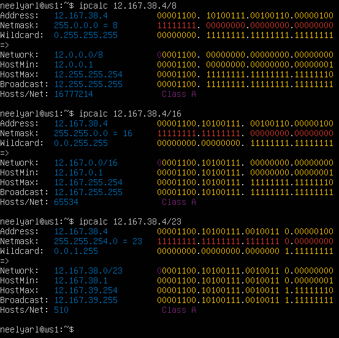
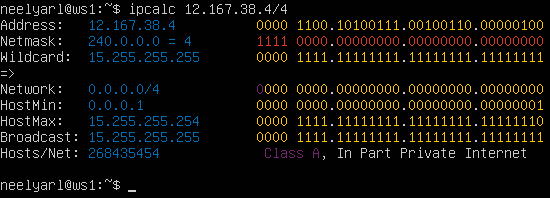

## Part 1. Инструмент ipcalc

### 1.1. Сети и маски

* Определить и записать в отчет:
  - Адрес сети 192.167.38.54/13;

      >_Для того чтобы узнать IP-адрес сети, необходимо поразрядно перемножить двоичные представления маски подсети и IP-адреса какого-либо хоста той же сети._
      
      ip:   11000000.10100111.00100110.00110110

      mask: 11111111.11111000.00000000.00000000

      addr: 11000000.10100000.00000000.00000000 - адрес сети в двоичной записи

       ***192.160.0.0*** - адрес сети в обычной записи

   - Перевод маски 255.255.255.0 в префиксную и двоичную запись, /15 в обычную и двоичную, 11111111.11111111.11111111.11110000 в обычную и префиксную;
      |        Mask                         |     Default    |   Prefix   |              Binary               |
      |:-----------------------------------:|:--------------:|:----------:|:---------------------------------:|
      | 255.255.255.0                       |255.255.255.0   |/24         |11111111.11111111.11111111.00000000|
      | /15                                 |255.254.0.0     |/15         |11111111.11111110.00000000.00000000|
      | 11111111.11111111.11111111.11110000 |255.255.255.240 |/28         |11111111.11111111.11111111.11110000|

   - Минимальный и максимальный хост в сети 12.167.38.4 при масках: /8, 11111111.11111111.00000000.00000000, 255.255.254.0 и /4;

      |              ip (12.167.38.4)      |                 Mask              |                      Network                    |              HostMin              |             Hostmax               |
      |:----------------------------------:|:---------------------------------:|:-----------------------------------------------:|:---------------------------------:|:---------------------------------:|
      | 00001100.10100111.00100110.00000100|11111111.00000000.00000000.00000000|00001100.00000000.00000000.00000000  (12.0.0.0)  |00001100.00000000.00000000.00000001|00001100.11111111.11111111.11111110|
      | 00001100.10100111.00100110.00000100|11111111.11111111.00000000.00000000|00001100.10100111.00000000.00000000  (12.167.0.0)|00001100.10100111.00000000.00000001|00001100.10100111.11111111.11111110|
      | 00001100.10100111.00100110.00000100|11111111.11111111.11111110.00000000|00001100.10100111.00100110.00000000 (12.167.38.0)|00001100.10100111.00100110.00000001|00001100.10100111.00100111.11111110|
      | 00001100.10100111.00100110.00000100|11110000.00000000.00000000.00000000|00000000.00000000.00000000.00000000 (0.0.0.0)    |00000000.00000000.00000000.00000001|00001111.11111111.11111111.11111110|

::

     HostMin & Hostmax 

              

                     HostMin & Hostmax 

  ### 1.2. localhost