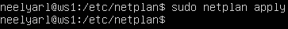
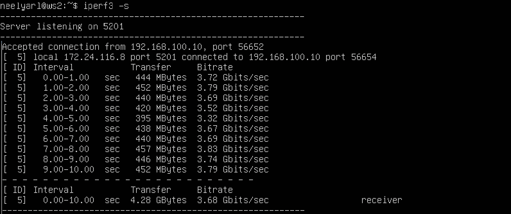
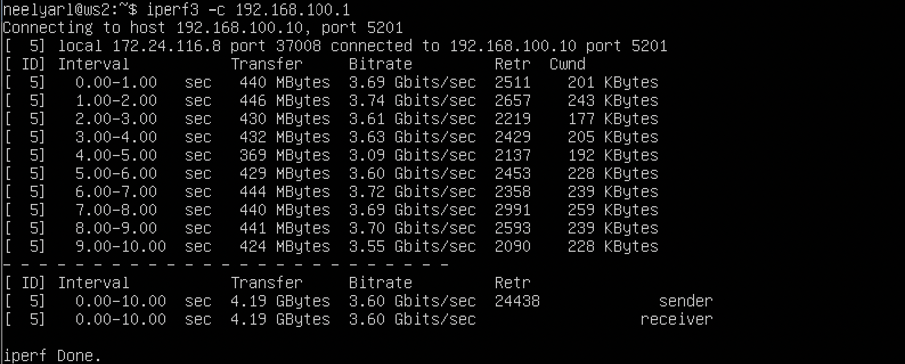

## Part 1. Инструмент ipcalc

### 1.1. Сети и маски

* Определить и записать в отчет:
  - Адрес сети ```192.167.38.54/13```;

      >_Для того чтобы узнать IP-адрес сети, необходимо поразрядно перемножить двоичные представления маски подсети и IP-адреса какого-либо хоста той же сети._
      
      ip:   ```11000000.10100111.00100110.00110110```

      mask: ```11111111.11111000.00000000.00000000```

      addr: ```11000000.10100000.00000000.00000000``` - адрес сети в двоичной записи

       ***192.160.0.0*** - адрес сети в обычной записи

   - Перевод маски ```255.255.255.0``` в префиксную и двоичную запись, ```/15``` в обычную и двоичную, ```11111111.11111111.11111111.11110000``` в обычную и префиксную;
      |        Mask                         |     Default    |   Prefix   |              Binary               |
      |:-----------------------------------:|:--------------:|:----------:|:---------------------------------:|
      | 255.255.255.0                       |255.255.255.0   |/24         |11111111.11111111.11111111.00000000|
      | /15                                 |255.254.0.0     |/15         |11111111.11111110.00000000.00000000|
      | 11111111.11111111.11111111.11110000 |255.255.255.240 |/28         |11111111.11111111.11111111.11110000|

   - Минимальный и максимальный хост в сети ```12.167.38.4``` при масках: ```/8```, ```11111111.11111111.00000000.00000000```, ```255.255.254.0``` и ```/4```;

      |              ip (12.167.38.4)      |                 Mask              |                      Network                    |              HostMin              |             Hostmax               |
      |:----------------------------------:|:---------------------------------:|:-----------------------------------------------:|:---------------------------------:|:---------------------------------:|
      | 00001100.10100111.00100110.00000100|11111111.00000000.00000000.00000000|00001100.00000000.00000000.00000000  (12.0.0.0)  |00001100.00000000.00000000.00000001|00001100.11111111.11111111.11111110|
      | 00001100.10100111.00100110.00000100|11111111.11111111.00000000.00000000|00001100.10100111.00000000.00000000  (12.167.0.0)|00001100.10100111.00000000.00000001|00001100.10100111.11111111.11111110|
      | 00001100.10100111.00100110.00000100|11111111.11111111.11111110.00000000|00001100.10100111.00100110.00000000 (12.167.38.0)|00001100.10100111.00100110.00000001|00001100.10100111.00100111.11111110|
      | 00001100.10100111.00100110.00000100|11110000.00000000.00000000.00000000|00000000.00000000.00000000.00000000 (0.0.0.0)    |00000000.00000000.00000000.00000001|00001111.11111111.11111111.11111110|

<p align="center">
  
  <p align="center">
    <sup> HostMin & Hostmax </sup>
  </p>
</p>

<p align="center">
  
  <p align="center">
    <sup> HostMin & Hostmax </sup>
  </p>
</p>

  ### 1.2. localhost
  * Можно ли обратиться к приложению, работающему на localhost, со следующими IP: ```194.34.23.100```, ```127.0.0.2```, ```127.1.0.1```, ```128.0.0.1``` ?
  > localhost (так называемый, «местный» от англ. local, или «локальный хост», по смыслу — этот компьютер) — в компьютерных сетях, стандартное, официально зарезервированное доменное имя для частных IP-адресов (в диапазоне **127.0.0.1 — 127.255.255.254**, RFC 2606).

                            194.34.23.100 - нет
                            127.0.0.2 - да
                            127.1.0.1 - да
                            128.0.0.1 - нет

  ### 1.3. Диапазоны и сегменты сетей

  * Определить и записать в отчет:
    - какие из перечисленных IP можно использовать в качестве публичного, а какие только в качестве частных: ```10.0.0.45```, ```134.43.0.2```, ```192.168.4.2```, ```172.20.250.4```, ```172.0.2.1```, ```192.172.0.1```, ```172.68.0.2```, ```172.16.255.255```, ```10.10.10.10```, ```192.169.168.1``` ?


    > Зарезервированный диапазон для частных ip-адресов:
    >  - Класс А: 10.0.0.0 – 10.255.255.255
    >  - Класс Б: 172.16.0.0 – 172.31.255.255
    >  - Класс С: 192.168.0.0 – 192.168.255.255
      
      Следовательно:
      |        ip-адрес         |     Тип    |
      |:-----------------------:|:----------:|
      | ```10.0.0.45```         | частный    |
      | ```134.43.0.2```        | публичный  |
      | ```192.168.4.2```       | частный    |
      | ```172.20.250.4```      | частный    |
      | ```172.0.2.1```         | публичный  |
      | ```192.172.0.1```       | публичный  |
      | ```172.68.0.2```        | публичный  |
      | ```172.16.255.255```    | частный    |
      | ```10.10.10.10```       | частный    |
      | ```192.169.168.1```     | публичный  |

    - какие из перечисленных IP адресов шлюза возможны у сети ```10.10.0.0/18```: ```10.0.0.1```, ```10.10.0.2```, ```10.10.10.10```, ```10.10.100.1```, ```10.10.1.255``` ?
<p align="center">
  
  <p align="center">
    <sup> ipcalc 10.10.0.0/18 </sup>
  </p>
</p>

Возможные ip-адреса находятся в диапазоне [HostMin, HostMax] = [```10.10.0.1```, ```10.10.63.254```].

Это **10.10.0.2**, **10.10.10.10**, **10.10.1.255**.

## Part 2. Статическая маршрутизация между двумя машинами

- Поднять две виртуальные машины (далее -- ws1 и ws2)

- С помощью команды ip a посмотреть существующие сетевые интерфейсы

<p align="center">
  
  <p align="center">
    <sup> ip a  command. Вывод для обеих машин одинаковый </sup>
  </p>
</p>
<p align="center">
  
  
  <p align="center">
    <sup> yaml file ws1 & ws2 </sup>
  </p>
</p>

<p align="center">
  
  
  <p align="center">
    <sup> ws1, ws2 netplan apply </sup>
  </p>
</p>

### 2.1 Добавление статического маршрута вручную

* Добавить статический маршрут от одной машины до другой и обратно при помощи команды вида ip r add

<p align="center">
  
    <p align="center">
    <sup> ip r add dev enp0s8 ws1 </sup>
  </p>
  
  <p align="center">
    <sup> ip r add dev enp0s8 ws2 </sup>
  </p>
</p>

* Пропинговать соединение между машинами

<p align="center">
  
    <p align="center">
    <sup> ping from ws1 </sup>
  </p>
  
  <p align="center">
    <sup> ping from ws2 </sup>
  </p>
</p>

### 2.2 Добавление статического маршрута c сохранением

* Перезапустить машины

* Добавить статический маршрут от одной машины до другой с помощью файла etc/netplan/00-installer-config.yaml

<p align="center">
  
  
  <p align="center">
    <sup> yaml file ws1 & ws2 </sup>
  </p>
</p>

* Пропинговать соединение между машинами

<p align="center">
  
  <p align="center">
    <sup> ping from ws1 </sup>
  </p>
  
  <p align="center">
    <sup> ping from ws2 </sup>
  </p>
</p>

## Part 3. Утилита iperf3

### 3.1 Скорость соединения

* Перевести и записать в отчёт: 8 Mbps в MB/s, 100 MB/s в Kbps, 1 Gbps в Mbps
  - 8 Mbps = 1 MB/s
  - 100 MB/s = 819200 Kbps
  - 1 Gbps = 1024 Mbps

### 3.2 Утилита iperf3

> Iperf3 — кроссплатформенная консольная клиент-серверная программа — генератор TCP и UDP трафика для тестирования пропускной способности сети. С ее помощью довольно просто измерить
> максимальную пропускную способность сети между сервером и клиентом и провести нагрузочное тестирование канала связи.

* Измерить скорость соединения между ws1 и ws2

<p align="center">
  
  <p align="center">
    <sup> iperf3 -c (ws1) </sup>
  </p>
  
  <p align="center">
    <sup> iperf3 -s (ws2) </sup>
  </p>
  
  <p align="center">
    <sup> iperf3 -c (ws2) </sup>
  </p>
  
  <p align="center">
    <sup> iperf3 -s (ws1) </sup>
  </p>
</p>

## Part 4. Сетевой экран

### 4.1. Утилита iptables

* Создать файл /etc/firewall.sh, имитирующий фаерволл, на ws1 и ws2:

```
#!/bin/sh

# Удаление всех правил в таблице "filter" (по-умолчанию).
iptables –F
iptables -X
```

* Нужно добавить в файл подряд следующие правила:
  - на ws1 применить стратегию когда в начале пишется запрещающее правило, а в конце пишется разрешающее правило (это касается пунктов 4 и 5)
  - на ws2 применить стратегию когда в начале пишется разрешающее правило, а в конце пишется запрещающее правило (это касается пунктов 4 и 5)
  - открыть на машинах доступ для порта 22 (ssh) и порта 80 (http)
  - запретить echo reply (машина не должна "пинговаться”, т.е. должна быть блокировка на OUTPUT)
  - разрешить echo reply (машина должна "пинговаться")

* В отчёт поместить скрины с содержанием файла /etc/firewall для каждой машины.

<p align="center">
  
  
  <p align="center">
    <sup> ws1 & ws2 etc/firewall </sup>
  </p>
</p>

* Запустить файлы на обеих машинах командами chmod +x /etc/firewall.sh и /etc/firewall.sh
<p align="center">
  
  
  <p align="center">
    <sup> ws1 & ws2 run firewall </sup>
  </p>
</p>

 - В первом случае мы запрещаем весь трафик, включает ssh и http порты, а затем разрешаем трафик. Второй случай зеркальный (сначала разрешение, затем запрет)

 ### 4.2. Утилита nmap

 * Командой ping найти машину, которая не "пингуется", после чего утилитой nmap показать, что хост машины запущен

 > Проверка: в выводе nmap должно быть сказано: Host is up

<p align="center">
  
  
  <p align="center">
    <sup> ws1 & ws2 nmap </sup>
  </p>
</p>

## Part 5. Статическая маршрутизация сети

Сеть:

<p align="center">
  
  <p align="center">
    <sup> network scheme </sup>
  </p>
</p>

* Поднять пять виртуальных машин (3 рабочие станции (ws11, ws21, ws22) и 2 роутера (r1, r2)).

### 5.1. Настройка адресов машин

* Настроить конфигурации машин в etc/netplan/00-installer-config.yaml согласно сети на рисунке.

<p align="center">
  
  <p align="center">
    <sup> ws11 </sup>
  </p>
</p>
<p align="center">
  
  <p align="center">
    <sup> r1 </sup>
  </p>
</p>
<p align="center">
  
  <p align="center">
    <sup> r2 </sup>
  </p>
</p>
<p align="center">
  
  <p align="center">
    <sup> ws22 </sup>
  </p>
</p>
<p align="center">
  
  <p align="center">
    <sup> ws21 </sup>
  </p>
</p>

* Перезапустить сервис сети. Если ошибок нет, то командой ip -4 a проверить, что адрес машины задан верно. Также пропинговать ws22 с ws21. Аналогично пропинговать r1 с ws11.